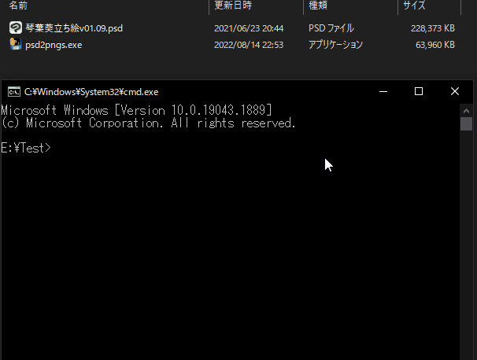

# psd2pngs

[日本語の説明](#日本語の説明)

## Introduction

psd2pngs converts a psd file to png files while maintaining the layer hierarchy and performing the appropriate renaming, using multiprocessing.
An onefile executable(.exe) file [`psd2pngs.exe`](https://github.com/34j/psd2pngs/releases) is also available.

## Example


Note that this GIF is in fast forward.

## Usage

- Just open `.psd` file with this app. ([Executable version](https://github.com/34j/psd2pngs/releases) only.)
- Alternatively, this app can also be used with command prompt.

```shell
> psd2pngs -h
Usage: psd2pngs [OPTIONS] PSD_PATH

Options:
  -v, --version              Show the version and exit.
  -o, --out PATH             Output directory path. If not specified, output
                             to the same directory as the PSD file.
  -s, --single-process       Force not to use multiprocessing.
  -t, --tasks-count INTEGER  Number of tasks. Recommended to be less than or
                             equal to the number of CPUs (32) because the
                             process maximizes the use of CPUs.
  -j, --json                 Output JSON file containing layer information.
  -h, -?, --help             Show this message and exit.
```

## Installation

### Option 1. Executable version

Download the latest release from [Releases](https://github.com/34j/psd2pngs/releases).

### Option 2. Python version using pip install

```shell
py -m venv venv
"./venv/Scripts/Activate.bat"
pip install git+https://github.com/34j/psd2pngs.git
psd2pngs from.psd
```

### Option 3. Python version using git clone

```shell
git clone https://github.com/34j/psd2pngs.git
cd ./psd2pngs
py -m venv venv
"./venv/Scripts/Activate.bat"
pip install -r requirements.txt
python -m psd2pngs from.psd
```

### Option 4. Executable version - Compiling yourself using pip

```shell
py -m venv venv
"./venv/Scripts/Activate.bat"
pip install git+https://github.com/34j/psd2pngs.git
pip install pyinstaller
pyinstaller venv/Lib/site-packages/psd2pngs/__main__.py --onefile -n psd2pngs
move "./dist/psd2pngs.exe" "./"
./psd2pngs from.psd
```

### Option 5. Executable version - Compiling yourself using git

```shell
git clone https://github.com/34j/psd2pngs.git
cd ./psd2pngs
py -m venv venv
"./venv/Scripts/Activate.bat"
pip install -r requirements.txt
pip install pyinstaller
pyinstaller psd2pngs/__main__.py --onefile -n psd2pngs
move "./dist/psd2pngs.exe" "./"
./psd2pngs from.psd
```

## 日本語の説明

psd2pngsは、psdファイルをレイヤーの階層構造を維持したままpngファイルに変換し、適切なリネームを行うアプリケーションです。
1ファイルにまとまったWindows用実行ファイル[`psd2pngs.exe`](https://github.com/34j/psd2pngs/releases)も配布しています。

### インストール方法

- [Releases](https://github.com/34j/psd2pngs/releases)から最新のリリースをダウンロードします。

### 使い方

- psdファイルを右クリックし、`プログラムから開く`を使ってこのアプリで開きます。
